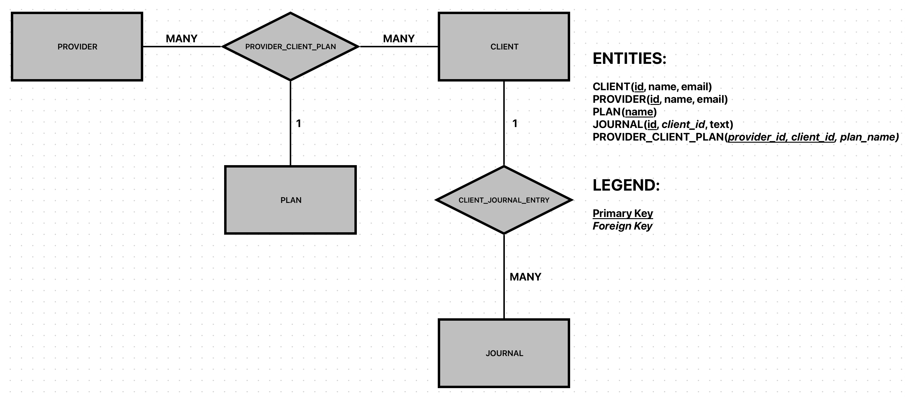

# Demo - Ruby Database Model And Queries

### Problem Description

We want to model providers (e.g. dietitians), their clients, and journal entries.
- Both providers and clients have a name and an email address.
- Providers have many clients
- Clients usually have one Provider but can have more than one.
- Clients have a plan that they paid for, signified by the string "basic" or "premium". For each
provider that a client is signed up with, they have 1 plan.
- Clients post journal entries. These consist of freeform text.

We want to be able to do these queries:
- Find all clients for a particular provider
- Find all providers for a particular client
- Find all of a particular client's journal entries, sorted by date posted
- Find all of the journal entries of all of the clients of a particular provider, sorted by date posted

Using ActiveRecord, create the classes and schema migrations for this, including indexes.

If possible, please use sqlite for your database.

Show how to do each of the queries listed above.

If you are torn between multiple approaches, just choose one to implement and explain the other approach and what the pros and cons of each might be.

### Problem Solution
- Entity-Relationship Diagram:

- A database approach is used with Ruby On Rails
    - The project utilizes the built-in SQLite local database.
    - MVC pattern is used:
        - Models represent data/tables in the db and utilize Active Records for interfacing with the db.
            - `models/client`.
            - `models/journal`.
            - `models/plan`.
            - `models/provider_client_plan`.
            - `models/provider`.
        - Services contain encapsulated business logic.
            - `services/client_service`.
            - `services/journal_service`.
            - `services/plan_service`.
            - `services/provider_client_plan_service`.
            - `services/provider_service`.
        - Controllers handle incoming web requests (e.g. Curl API request) and are mapped to routes defined in `/config/routes.rb`.
            - `controllers/clients_controller`.
            - `controllers/journals_controller`.
            - `controllers/plans_controller`.
            - `controllers/provider_client_plans_controller`.
            - `controllers/providers_controller`.
    - An API specification is generated and available in `swagger/v1/swagger.yaml`.
        - after starting up the rails server, visit `http://localhost:3000/api-docs` for an interactive API document.

## How To Run

- In a terminal, traverse to the `demo-ruby-db-queries-rails-api` directory
    - Run `bundle install` to install dependencies.
    - Run `rails db:migrate` to run migrations.
    - Run `rails db:seed` to run seeds.
    - If API is changed, run `rails rswag:spec:swaggerize` to generate API specification file.
    - Run `rails server` to locally deploy the API.
    - Access the API at `http://localhost:3000`.

### Other

- Ruby on Rails project created using the following command:
```
rails new demo-ruby-db-queries-rails-api --skip-turbolinks --skip-javascript --skip-coffee --skip-sprockets --skip-yarn --skip-action-cable --skip-git
```

